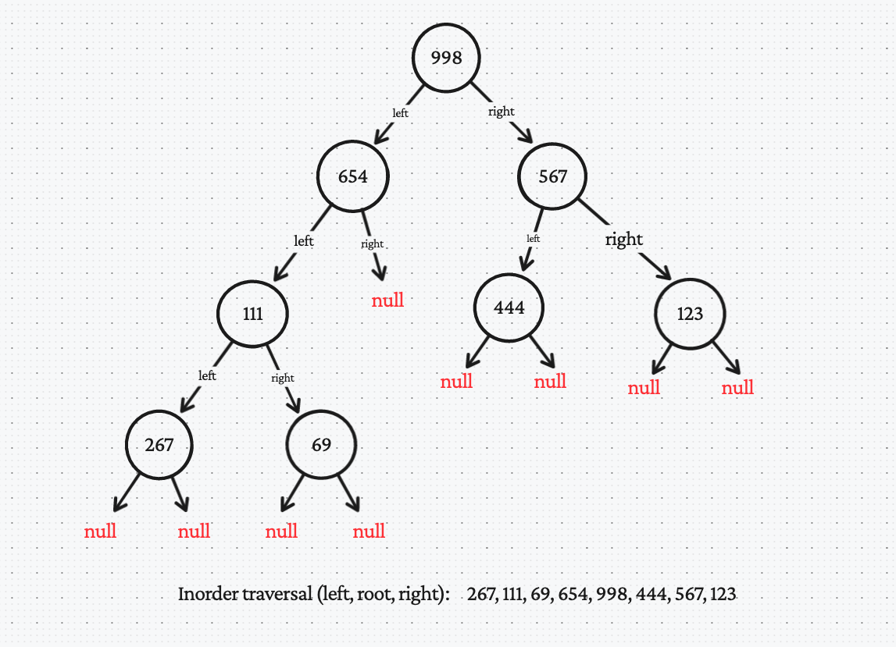

>If you’re thinking without writing, you only think you’re thinking - [Leslie Lamport](https://en.wikipedia.org/wiki/Leslie_Lamport)

I'm writing this post in an attempt to build intuition for solving algorithm and data structure coding problems. Hopefully you get something from it.

## Problem

Given a binary search tree, return the `inorder` traversal of its nodes values.

### What is `inorder` traversal of a Binary search tree?

Read the node values of the tree in the order; left, root, right.

## Iterative Solution

### Input



```javascript
/*

       998
       /\
    654  567
    /    / \
  111  444 123
  / \
267  69

*/

const tree = {
  left: {
    left: {
      left: {
        left: null,
        right: null,
        data: 267,
      },
      right: {
        left: null,
        right: null,
        data: 69,
      },
      data: 111,
    },
    right: null,
    data: 654,
  },
  right: {
    left: {
      left: null,
      right: null,
      data: 444,
    },
    right: {
      left: null,
      right: null,
      data: 123,
    },
    data: 567,
  },
  data: 998,
};

console.log(inorderTraversal(tree));

// (8) [267, 111, 69, 654, 998, 444, 567, 123]
```

```javascript
const inorderTraversal = function (A) {
  let inorderTraversal = [];
  if (!A) return inorderTraversal;

  let stack = [];
  stack.push(A);

  let current = A.left;
  while (stack.length || current) {
    // collect all left nodes
    while (current) {
      stack.push(current);
      current = current.left;
    }
    
    // next node on the stack
    let temp = stack.pop();
    // record its data value
    inorderTraversal.push(temp.data);
    // move to it's right child in preparation
    // for left side traveral
    current = temp.right;
  }

  return inorderTraversal;
};
```
We use the first `while` loop to collect each node on the left side of the current node, which starts with the root, and push the nodes onto the stack. You can see the root node is at the bottom of the stack and each left node is stacked on top.

```javascript
// stack
[998, 654, 111, 267]

// result 
[]
```

The outer `while` loop will then `pop()` the top element of the stack, collect this node's data value in our result array, move to this nodes right child, and then traverse the left side again and collect nodes. When the stack is empty we're done.

### Trace

> Pop, record, move to right child, collect left side nodes, repeat.

```javascript
// stack
[998, 654, 111]

// result
[267]
```

```javascript
// stack
[998, 654, 69]

// result
[267, 111]
```

```javascript
// stack
[998, 654]

// result
[267, 111, 69]
```

```javascript
// stack
[998]

// result
[267, 111, 69, 654]
```

```javascript
// stack
[567, 444]

// result
[267, 111, 69, 654, 998]
```

```javascript
// stack
[567]

// result
[267, 111, 69, 654, 998, 444]
```

```javascript
// stack
[123]

// result
[267, 111, 69, 654, 998, 444, 567]
```

```javascript
// stack
[]

// result
[267, 111, 69, 654, 998, 444, 567, 123]
```
# Related

- [Algorithms and data structures: Fuel station](/blog/algorithm-data-structures-problem-fuel-station/)
- [Algorithms and data structures: Two Sum](/blog/algorithm-data-structures-problem-two-sum)
