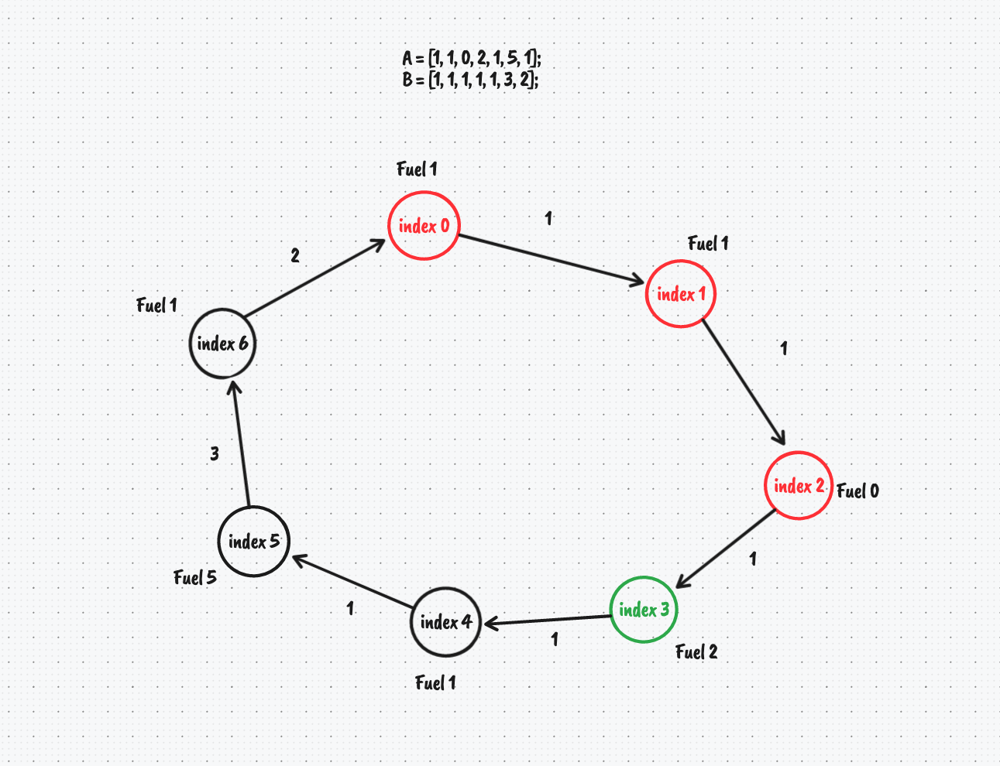

>If you’re thinking without writing, you only think you’re thinking - [Lesslie Lamport](https://en.wikipedia.org/wiki/Leslie_Lamport)

I'm writing this post in an attempt to build an intuition for solving algorithm and data structure coding problems. Hopefully this post makes sense when I'm done.

## Problem

There are N fuel stations along a circular route, where the amount of fuel at station **i** is A[i] and it cost B[i] in fuel to get to the next station. 

Return the lowest starting station index that allows you to complete a full journey of the circular route. You can only travel in one direction, if it's not possible to complete a full circular journey return -1;

## Example

```text
A = [1, 1, 0, 2, 1, 5, 1];  
B = [1, 1, 1, 1, 1, 3, 2];
```

Given the arrays A and B, the lowest starting index that allows a complete circular journey is starting at station with index 3.

```text
// lowest starting index
3 -> 4 -> 5 -> 6 -> 0 -> 1 -> 2 -> 3

// other possible route
5 -> 6 -> 0 -> 1 -> 2 -> 3 -> 4 -> 5 
```



## Solution

```javascript
var canCompleteCircuit = function (A, B) {
  let totalNumberOfStations = A.length;
  let numStationsVisited = 0;
  let tank = 0;

  // worst case we only need to check (totalNumberOfStations * 2) - 1
  // because after this we are re-visiting stations
  for (let i = 0; i < totalNumberOfStations * 2 - 1; i++) {
    let index = i % totalNumberOfStations;

    // travel to the next station and calculate fuel
    tank = tank + (A[index] - B[index]);

    // did we make it to the station?
    if (tank < 0) {
      // nope, start counting the number of visited stations again
      numStationsVisited = 0;
      tank = 0;
    } else {
      // yes! we can record our visit
      numStationsVisited++;
    }

    // have we visited the max number of stations
    // possible in this circular journey?
    if (numStationsVisited >= totalNumberOfStations) {
      // yes! return the station index that we started at
      return (index + 1) % totalNumberOfStations;
    }

    // nope, try to travel to the next station
  }

  // we've arrived at the last station and we failed to
  // visit enough stations to complete a full circular journey
  // which means it's not possible
  return -1;
};
```