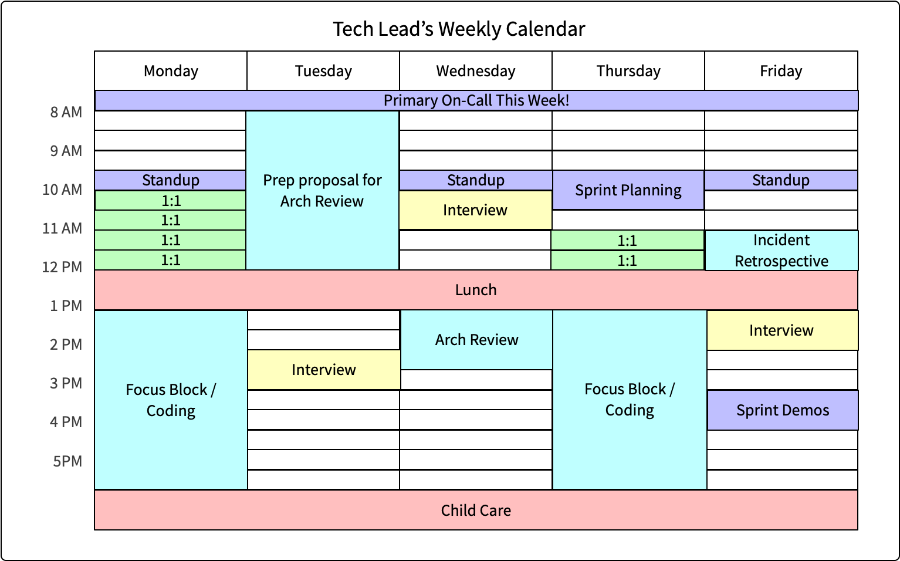
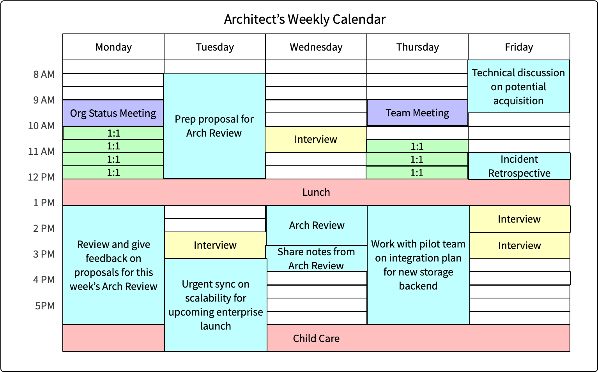
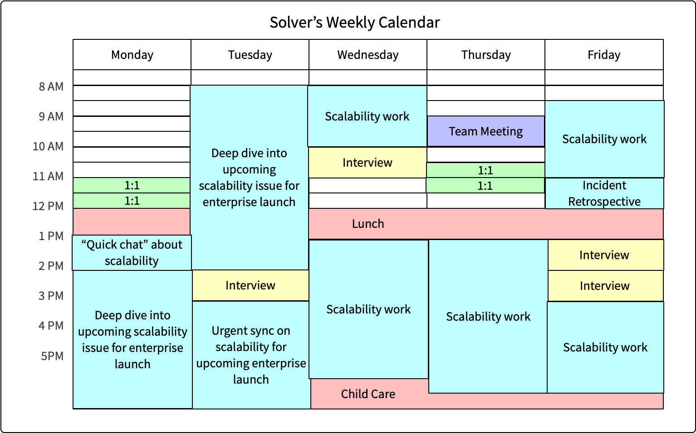
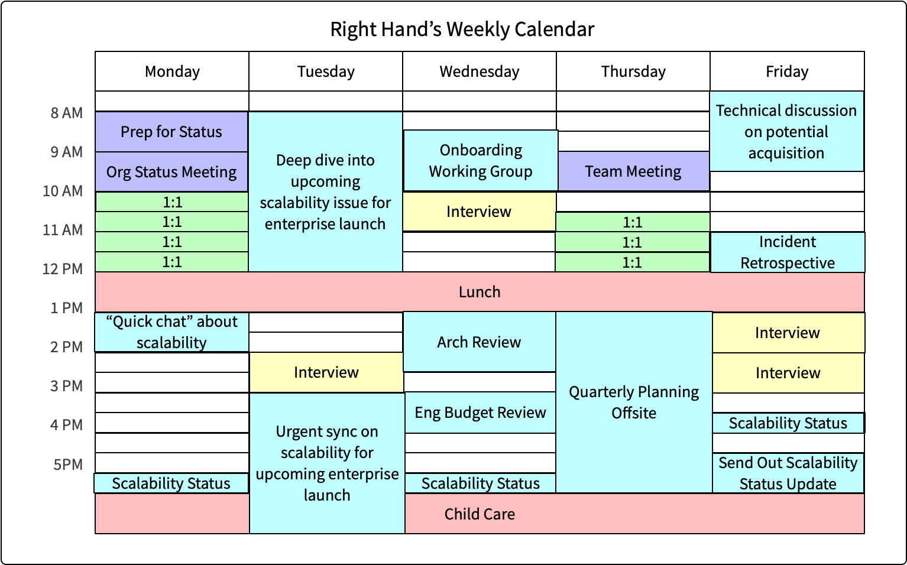

> Every engineer should be allocating their time to execution, learning, planning, and support in different ratios. This post is a cognitive artefact outlining the responsibility ratios of a Staff+ Engineer, adjust ratios to suit yourself

You've been promoted to Staff+ Engineer, now what? re-allocate your time.

## Staff+ Engineer Responsibilities

50% Delivery and Execution (2.5 days)
- Develops, reviews, tests, deploys, maintains, and releases software with a clear understanding of the value the software is to provide
- Develops test suites (unit, integration, e2e, etc) to enable rapid, and successful, deployment of code to production
- Takes on new opportunities and tough challenges with a sense of urgency, high energy, and enthusiasm

20% Support (1 day)
- Answers questions from Product, UX, Engineering, and Executive teams and pre-empts questions with spikes, proof of concepts, technical feasibility research, and discoverability
- Mentors other engineers through 1:1s, sponsorhips, delegation of tasks to increase visibility, pair programming sessions, and leads by example
- Notes gaps on teams and provides suggestions for changes to make them more productive, e.g. workshops, conferences, strategies to improve autonomy, development process improvements, etc.
- Improves the developer experience by introducing new developer tooling, creating templates for pull/change requests, automates code linting and formatting, etc.

20% Planning (1 day)
- Creates strategies to help the organisation be more successful and increase team/group autonomy. How can groups, teams, or individuals make decisions in your absence? 
- Delivers multi-mode communications that convey a clear understanding of the unique needs of different audiences, e.g. diagrams, knowledge sharing videos, documentation, demos, etc.
- Works with Product, UX, Engineering, and Executive teams to ensure tasks are developer ready, easy to understand, and verifiable
- Collaborates in agile processes and relates comfortably with diverse groups of people

10% Learning (0.5 day)
- Actively seeks ways to grow and be challenged using both formal and informal development channels
- Learns through successful and failed experimentation when tackling new problems
- Identifies skill gaps and seeks out peers for mentoring and guidance to close these gaps

In my experience as you move closer to the principal engineer role the ratios between execution and support will change more so than planning and learning. As you become more familiar with the organisation you will need to provide more organisational wide support compared to writing code for a specific product. So for example, Principal Engineer ratios may look more like 20% execution, 50% support, 20% planning, and 10% learning.

## Staff+ Engineer Archetypes

*The below archetypes and their descriptions are taken directly from [StaffEng.com](https://staffeng.com/guides/staff-archetypes/), to get a more in-depth explanation of each archetype and a bunch of other very useful stuff go take a look at their site.*

### Tech Lead

The Tech Lead guides the approach and execution of a particular team. They partner closely with a single manager, but sometimes they partner with two or three managers within a focused area. Some companies also have a Tech Lead Manager role, which is similar to the Tech Lead archetype but exists on the engineering manager ladder and includes people management responsibilities.

[staffeng.com/guides/staff-archetypes/](https://staffeng.com/guides/staff-archetypes/)

### Architect

The Architect is responsible for the direction, quality, and approach within a critical area. They combine in-depth knowledge of technical constraints, user needs, and organisation level leadership.

[staffeng.com/guides/staff-archetypes/](https://staffeng.com/guides/staff-archetypes/)

### Solver

The Solver digs deep into arbitrarily complex problems and finds an appropriate path forward. Some focus on a given area for long periods. Others bounce from hotspot to hotspot as guided by organisational leadership.

[staffeng.com/guides/staff-archetypes/](https://staffeng.com/guides/staff-archetypes/)

### Right Hand

The Right Hand extends an executive's attention, borrowing their scope and authority to operate particularly complex organisations. They provide additional leadership bandwidth to leaders of large-scale organisations.

[staffeng.com/guides/staff-archetypes/](https://staffeng.com/guides/staff-archetypes/)

## Summary

Staff+ engineers are expected to be a force multiplier for the organisation they are working with. You can only do that by getting out of the trees and seeing the forest. The first step to doing this is reducing your coding time and increasing your knowledge of the organisation, it's people, and the projects they are working on. Go talk to people about what they are doing! make friends, shake off that imposter syndrome, we're all just making it up as we go along, good luck!.

## References

- [Staff Engineer Archetypes](https://staffeng.com/guides/staff-archetypes/)